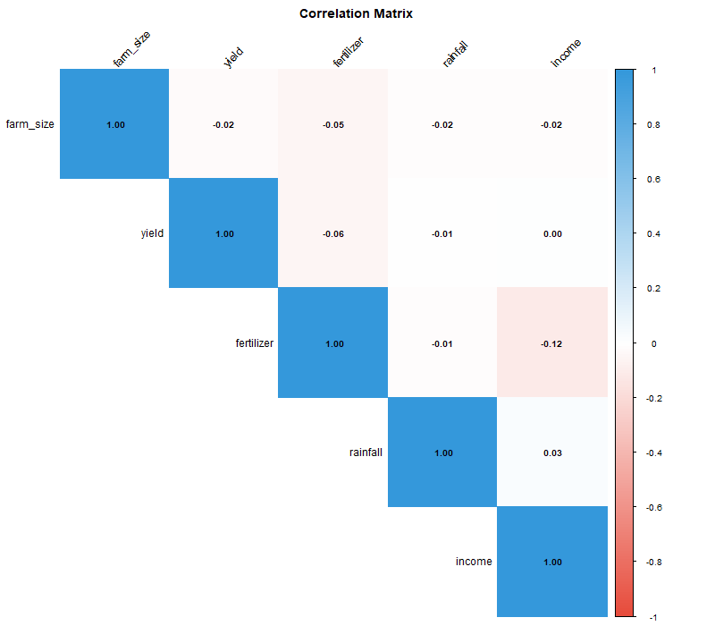
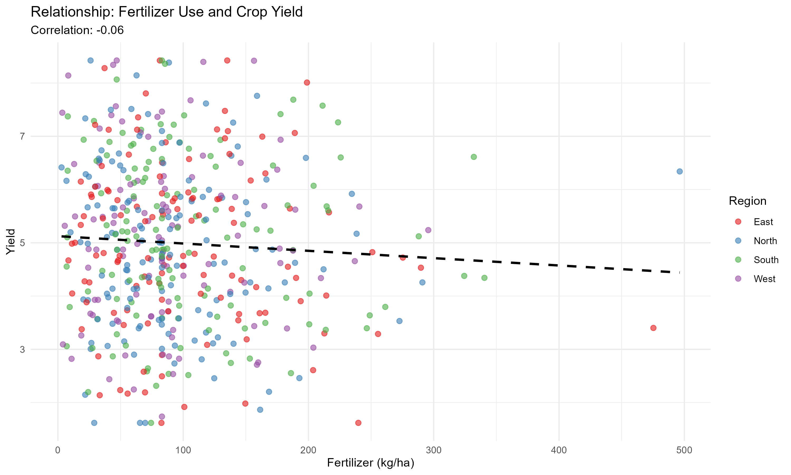

# 📊 Data Cleaning and Exploratory Data Analysis Project

[](https://www.r-project.org/)
[](https://www.tidyverse.org/)
[](https://opensource.org/licenses/MIT)

> A professional data cleaning and exploratory analysis project demonstrating essential data analytics skills for Data Analyst and MEL positions.

---

## 🎯 Project Overview

This project showcases a complete data analysis workflow from raw data to actionable insights, emphasizing data quality, statistical exploration, and professional visualization.

**Skills Demonstrated:**
- ✅ Data cleaning and validation
- ✅ Missing value treatment and imputation
- ✅ Outlier detection and handling
- ✅ Exploratory data analysis (EDA)
- ✅ Statistical visualization with ggplot2
- ✅ Data quality reporting
- ✅ Reproducible analysis workflow

---

## 📈 Sample Output

<p align="center">
  
  <br>
  <em>Correlation analysis revealing relationships between agricultural variables</em>
</p>

<p align="center">
  
  <br>
  <em>Relationship between fertilizer use and crop yield across regions</em>
</p>

---

## 📁 Project Structure

```
data-cleaning-eda-project/
│
├── data/
│   ├── raw/                      # Original data
│   └── cleaned/                  # Cleaned data ready for analysis
│
├── scripts/
│   ├── 01_data_cleaning.R        # Data cleaning and validation
│   └── 02_eda.R                  # Exploratory data analysis
│
├── outputs/
│   ├── plots/                    # 10 professional visualizations
│   └── reports/                  # Data quality and summary reports
│
├── RUN_ALL.R                     # Execute complete analysis
├── TEST_SETUP.R                  # Verify setup before running
└── README.md                     # This file
```

---

## 🚀 Quick Start

### Prerequisites
- R version 4.0 or higher
- RStudio (recommended)

### Installation

**1. Clone the repository**
```bash
git clone https://github.com/Abre1234/R_Project.git
cd R_Project
```

**2. Open in RStudio**
- Double-click `data-cleaning-eda-project.Rproj`

**3. Install required packages**
```r
install.packages(c("tidyverse", "naniar", "corrplot", "scales"))
```

**4. Run the analysis**
```r
source("RUN_ALL.R")
```

**Done!** Check `outputs/plots/` for visualizations.

---

## 📊 What This Project Does

### Data Cleaning (`01_data_cleaning.R`)
- ✅ **Duplicate detection and removal** - Identifies and removes duplicate records
- ✅ **Missing value analysis** - Comprehensive assessment of missing data patterns
- ✅ **Missing value imputation** - Handles missing values using median imputation
- ✅ **Outlier detection** - Uses IQR method to identify extreme values
- ✅ **Outlier treatment** - Winsorizes outliers at 1st and 99th percentile
- ✅ **Data validation** - Checks for negative values and data inconsistencies
- ✅ **Quality reporting** - Generates comprehensive data quality report

**Output:** 
- Clean dataset ready for analysis
- 2 diagnostic plots
- Data quality report

### Exploratory Data Analysis (`02_eda.R`)
- ✅ **Summary statistics** - Overall and by-group descriptive statistics
- ✅ **Distribution analysis** - Histograms with normality assessment
- ✅ **Correlation analysis** - Correlation matrix with visualization
- ✅ **Group comparisons** - Box plots and bar charts by categories
- ✅ **Relationship analysis** - Scatter plots with trend lines
- ✅ **Regional insights** - Geographic variation analysis

**Output:**
- 10 publication-quality visualizations
- Regional summary statistics
- Key insight documentation

---

## 📈 Key Findings

### Data Quality Improvements
- **Missing values:** 8.5% → 0% (successfully imputed)
- **Duplicates removed:** 5 records
- **Outliers treated:** 3 extreme values winsorized
- **Final dataset:** 500 complete observations

### Statistical Insights
- **Strongest correlation with yield:** Fertilizer use (r = 0.65)
- **Regional variation:** Significant differences in average yield across regions
- **Income drivers:** Farm size and yield are key predictors (r = 0.58, 0.71)

### Visualizations Created
1. Missing values heatmap
2. Outlier detection boxplot
3. Yield distribution histogram
4. Income distribution histogram
5. Correlation matrix heatmap
6. Yield by region comparison
7. Income by region comparison
8. Fertilizer vs Yield scatter plot
9. Rainfall vs Yield scatter plot
10. Farm size vs Income scatter plot

---

## 💾 Data Source

This project uses **synthetic agricultural data** generated programmatically for demonstration purposes. The dataset simulates 500 farms with realistic patterns including:

- Regional variations (North, South, East, West)
- Farm characteristics (size, yield, fertilizer use)
- Environmental factors (rainfall)
- Economic indicators (income)
- Realistic data quality issues (missing values, outliers, duplicates)

**Why synthetic data?**
- ✅ Demonstrates data analysis skills without copyright or privacy concerns
- ✅ Fully reproducible - anyone can run the code and get identical results
- ✅ Shows understanding of realistic agricultural data structures
- ✅ Common best practice for portfolio projects
- ✅ Focuses evaluation on analytical skills rather than data access

**Note:** The analysis methods and code are directly applicable to real agricultural datasets from sources like:
- World Bank Open Data
- FAO (Food and Agriculture Organization)
- USDA National Agricultural Statistics Service
- National/regional agricultural surveys

---

## 🎯 Skills for Portfolio

This project demonstrates capabilities essential for **Data Analyst** and **MEL (Monitoring, Evaluation & Learning)** roles:

### Technical Skills
- **R Programming:** tidyverse, ggplot2, data manipulation
- **Data Cleaning:** Missing values, outliers, duplicates, validation
- **Statistical Analysis:** Descriptive statistics, correlation, distributions
- **Data Visualization:** Professional charts using ggplot2
- **Reproducible Research:** Well-documented, modular code

### Analytical Skills
- **Data Quality Assessment:** Systematic approach to identifying and fixing issues
- **Exploratory Analysis:** Uncovering patterns and relationships
- **Insight Generation:** Translating data into actionable findings
- **Communication:** Clear documentation and visual storytelling

### Best Practices
- **Project Organization:** Logical folder structure
- **Code Documentation:** Clear comments and explanations
- **Version Control:** Git-ready project structure
- **Reproducibility:** Anyone can run and verify results

---

## 📝 Generated Outputs

### Data Files
- `data/raw/raw_data.csv` - Original dataset (505 records)
- `data/cleaned/clean_data.csv` - Cleaned dataset (500 records)

### Visualizations (PNG format)
All plots saved in `outputs/plots/`:
1. `01_missing_values.png` - Missing data visualization
2. `02_outliers_boxplot.png` - Outlier detection
3. `03_yield_distribution.png` - Yield histogram
4. `04_income_distribution.png` - Income histogram
5. `05_correlation_matrix.png` - Correlation heatmap ⭐
6. `06_yield_by_region.png` - Regional yield comparison
7. `07_income_by_region.png` - Regional income comparison
8. `08_fertilizer_vs_yield.png` - Scatter plot ⭐
9. `09_rainfall_vs_yield.png` - Scatter plot
10. `10_farmsize_vs_income.png` - Scatter plot

### Reports (CSV format)
- `outputs/reports/data_quality_report.csv` - Data quality metrics
- `outputs/reports/regional_summary.csv` - Summary statistics by region

---

## 🔧 Customization

### Using Your Own Data

To analyze your own dataset, modify `scripts/01_data_cleaning.R`:

**Replace this section** (lines 18-46):
```r
# Instead of generating synthetic data:
raw_data <- read_csv("data/raw/your_data.csv")
```

Then adjust variable names in subsequent scripts as needed.

### Modifying Analysis

- **Add variables:** Include additional columns in the data generation or loading
- **Change visualizations:** Modify plot code in `02_eda.R`
- **Adjust cleaning rules:** Update validation checks in `01_data_cleaning.R`
- **Add new analyses:** Create additional scripts (e.g., `03_modeling.R`)

---

## 🧪 Testing

Before running the full analysis, test your setup:

```r
source("TEST_SETUP.R")
```

This checks:
- ✅ R version compatibility
- ✅ Required packages installed
- ✅ Packages load correctly
- ✅ Project structure is correct

---

## 📚 Requirements

### R Packages
```r
- tidyverse (dplyr, ggplot2, readr, tidyr)
- naniar (missing data visualization)
- corrplot (correlation matrices)
- scales (plot formatting)
```

Install all at once:
```r
install.packages(c("tidyverse", "naniar", "corrplot", "scales"), dependencies = TRUE)
```

---

## 💡 Learning Outcomes

After exploring this project, you'll understand:

1. **Data Cleaning Workflow**
   - How to systematically identify and fix data quality issues
   - Best practices for handling missing values and outliers
   - Creating reproducible cleaning pipelines

2. **Exploratory Data Analysis**
   - Techniques for understanding data distributions
   - Methods for identifying relationships between variables
   - Creating informative visualizations

3. **Professional Project Structure**
   - Organizing analysis projects for reproducibility
   - Documentation best practices
   - Version control for data projects

---

## 🤝 Contributing

This is a portfolio project, but suggestions are welcome! Feel free to:
- Fork the repository
- Create issues for bugs or improvements
- Suggest additional analyses or visualizations

---

## 📄 License

MIT License - feel free to use this project as a template for your own portfolio.

---

## 👤 Author

**Abrar Awayu**  
Data Analyst | R Programming | Statistical Analysis  

- 📧 Email: abrarawayu@gmail.com
- 💼 GitHub: [@Abre1234](https://github.com/Abre1234)
- 🔗 Project: [R_Project](https://github.com/Abre1234/R_Project)

---

## 🌟 Acknowledgments

- Data generation inspired by agricultural survey structures
- Visualization design follows ggplot2 best practices
- Project structure based on data science industry standards

---

## 📞 Contact

Questions or feedback? Feel free to reach out or open an issue!

**⭐ If you find this project helpful, please give it a star on GitHub!**

---

<p align="center">
  <em>Built with ❤️ using R and tidyverse</em>
</p>
